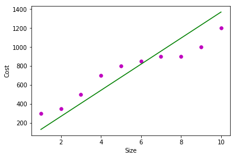

```python
import numpy as np 
import matplotlib.pyplot as plt

def estimate_coefficients(x, y): 
    # size of the dataset OR number of observations/points 
    n = np.size(x) 
  
    # mean of x and y
    # Since we are using numpy just calling mean on numpy is sufficient 
    mean_x, mean_y = np.mean(x), np.mean(y) 
  
    # calculating cross-deviation and deviation about x 
    SS_xy = np.sum(y*x - n*mean_y*mean_x) 
    SS_xx = np.sum(x*x - n*mean_x*mean_x) 
  
    # calculating regression coefficients 
    b_1 = SS_xy / SS_xx 
    b_0 = mean_y - b_1*mean_x 
  
    return(b_0, b_1)

    # x,y are the location of points on graph
    # color of the points change it to red blue orange play around


def plot_regression_line(x, y, b): 
    # plotting the points as per dataset on a graph
    plt.scatter(x, y, color = "m",marker = "o", s = 30) 

    # predicted response vector 
    y_pred = b[0] + b[1]*x 
  
    # plotting the regression line
    plt.plot(x, y_pred, color = "g")
  
    # putting labels for x and y axis
    plt.xlabel('Size') 
    plt.ylabel('Cost') 
  
    # function to show plotted graph
    plt.show()
    

    


def main(): 
    # Datasets which we create 
    x = np.array([ 1,   2,   3,   4,   5,   6,   7,   8,    9,   10]) 
    y = np.array([300, 350, 500, 700, 800, 850, 900, 900, 1000, 1200]) 
  
    # estimating coefficients 
    b = estimate_coefficients(x, y) 
    print("Estimated coefficients:\nb_0 = {} \nb_1 = {}".format(b[0], b[1])) 
  
    # plotting regression line 
    plot_regression_line(x, y, b)

    
if __name__ == "__main__": 
    main()
```

    Estimated coefficients:
    b_0 = -7.5 
    b_1 = 137.72727272727272




