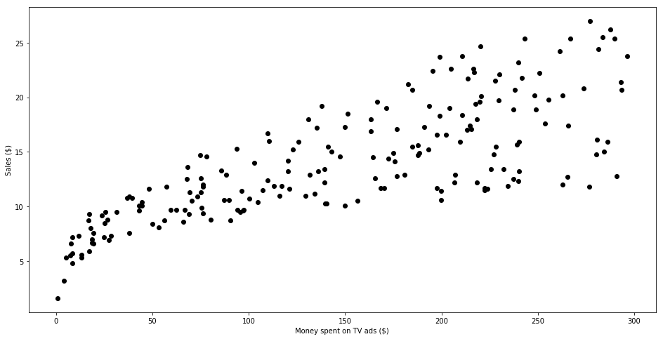
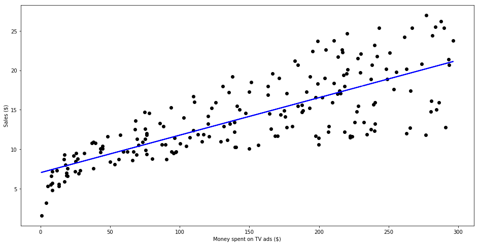

```python
import pandas as pd
import numpy as np
import matplotlib.pyplot as plt
from sklearn.linear_model import LinearRegression
from sklearn.metrics import r2_score


data = pd.read_csv("https://raw.githubusercontent.com/marcopeix/ISL-linear-regression/master/data/Advertising.csv")
data.head()
data.drop(['Unnamed: 0'], axis=1)
plt.figure(figsize=(16, 8))
plt.scatter(
    data['TV'],
    data['sales'],
    c='black'
)
plt.xlabel("Money spent on TV ads ($)")
plt.ylabel("Sales ($)")
plt.show()

X = data['TV'].values.reshape(-1,1)
y = data['sales'].values.reshape(-1,1)

reg = LinearRegression()
reg.fit(X, y)
print(reg.coef_[0][0])
print(reg.intercept_[0])

print("The linear model is: Y = {:.5} + {:.5}X".format(reg.intercept_[0], reg.coef_[0][0]))
```





    0.04753664043301975
    7.032593549127695
    The linear model is: Y = 7.0326 + 0.047537X


```python
import pandas as pd
import numpy as np
import matplotlib.pyplot as plt
from sklearn.linear_model import LinearRegression
from sklearn.metrics import r2_score


data = pd.read_csv("https://raw.githubusercontent.com/marcopeix/ISL-linear-regression/master/data/Advertising.csv")
data.head()
data.drop(['Unnamed: 0'], axis=1)
plt.figure(figsize=(16, 8))
plt.scatter(
    data['TV'],
    data['sales'],
    c='black'
)
plt.xlabel("Money spent on TV ads ($)")
plt.ylabel("Sales ($)")
plt.show()

X = data['TV'].values.reshape(-1,1)
y = data['sales'].values.reshape(-1,1)

reg = LinearRegression()
reg.fit(X, y)
print(reg.coef_[0][0])
print(reg.intercept_[0])

print("The linear model is: Y = {:.5} + {:.5}X".format(reg.intercept_[0], reg.coef_[0][0]))
predictions = reg.predict(X)

plt.figure(figsize=(16, 8))
plt.scatter(
    data['TV'],
    data['sales'],
    c='black'
)
plt.plot(
    data['TV'],
    predictions,
    c='blue',
    linewidth=2
)
plt.xlabel("Money spent on TV ads ($)")
plt.ylabel("Sales ($)")
plt.show()

```


    0.04753664043301975
    7.032593549127695
    The linear model is: Y = 7.0326 + 0.047537X





```python
import pandas as pd
import numpy as np
import matplotlib.pyplot as plt
from sklearn.linear_model import LinearRegression
from sklearn.metrics import r2_score
import statsmodels.api as sm


data = pd.read_csv("https://raw.githubusercontent.com/marcopeix/ISL-linear-regression/master/data/Advertising.csv")
data.head()
data.drop(['Unnamed: 0'], axis=1)
plt.figure(figsize=(16, 8))
plt.scatter(
    data['TV'],
    data['sales'],
    c='black'
)
plt.xlabel("Money spent on TV ads ($)")
plt.ylabel("Sales ($)")
plt.show()

X = data['TV'].values.reshape(-1,1)
y = data['sales'].values.reshape(-1,1)

reg = LinearRegression()
reg.fit(X, y)
print(reg.coef_[0][0])
print(reg.intercept_[0])

print("The linear model is: Y = {:.5} + {:.5}X".format(reg.intercept_[0], reg.coef_[0][0]))
predictions = reg.predict(X)

plt.figure(figsize=(16, 8))
plt.scatter(
    data['TV'],
    data['sales'],
    c='black'
)
plt.plot(
    data['TV'],
    predictions,
    c='blue',
    linewidth=2
)
plt.xlabel("Money spent on TV ads ($)")
plt.ylabel("Sales ($)")
plt.show()

X = data['TV']
y = data['sales']

X2 = sm.add_constant(X)
est = sm.OLS(y, X2)
est2 = est.fit()
print(est2.summary())
```


    0.04753664043301975
    7.032593549127695
    The linear model is: Y = 7.0326 + 0.047537X


                                OLS Regression Results                            
    ==============================================================================
    Dep. Variable:                  sales   R-squared:                       0.612
    Model:                            OLS   Adj. R-squared:                  0.610
    Method:                 Least Squares   F-statistic:                     312.1
    Date:                Mon, 25 Feb 2019   Prob (F-statistic):           1.47e-42
    Time:                        06:07:44   Log-Likelihood:                -519.05
    No. Observations:                 200   AIC:                             1042.
    Df Residuals:                     198   BIC:                             1049.
    Df Model:                           1                                         
    Covariance Type:            nonrobust                                         
    ==============================================================================
                     coef    std err          t      P>|t|      [0.025      0.975]
    ------------------------------------------------------------------------------
    const          7.0326      0.458     15.360      0.000       6.130       7.935
    TV             0.0475      0.003     17.668      0.000       0.042       0.053
    ==============================================================================
    Omnibus:                        0.531   Durbin-Watson:                   1.935
    Prob(Omnibus):                  0.767   Jarque-Bera (JB):                0.669
    Skew:                          -0.089   Prob(JB):                        0.716
    Kurtosis:                       2.779   Cond. No.                         338.
    ==============================================================================
    
    Warnings:
    [1] Standard Errors assume that the covariance matrix of the errors is correctly specified.

